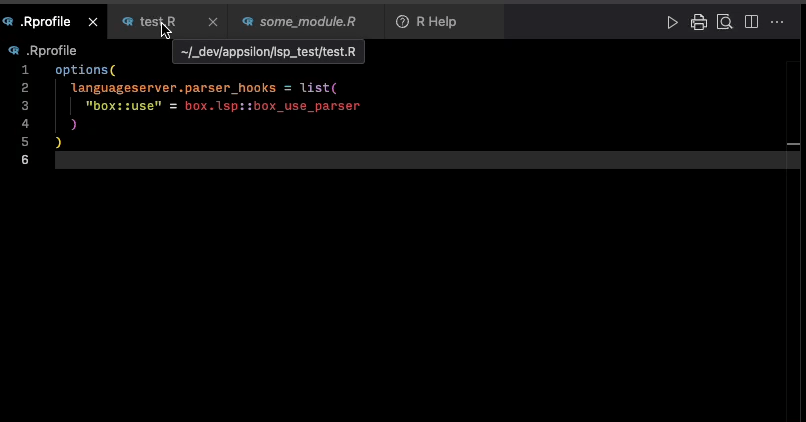

# box.lsp <a href="https://appsilon.github.io/box.lsp/"></a>
> _Experimental* custom language server parser hook for `{box}` modules._

<!-- badges: start -->
[](https://cran.r-project.org/package=box.lsp)
[](https://github.com/Appsilon/box.lsp/actions/workflows/test-and-lint.yaml)
<!-- badges: end -->

This package is an attempt to provide `{box}`-compatibility for `{languageserver}` used in VS Code.

The code is based on initial work by [Pavel Demin](https://github.com/Gotfrid).

## What Works

| `box::use()`              | Code completion | Param completion | Tooltip help | As of version | Notes |
|---------------------------|:-:|:-:|:-:|--------:|:-:|
| `pkg[...]`                | &check; | &check; | &check; | 0.1.0 | Full support |
| `pkg[attach_list]`        | &check; | &check; | &check; | 0.1.0 | Link to documentation |
| `pkg`                     |   |   |   |         |   |
| `prefix/mod[...]`         | &check; | &check; | &check; | 0.1.0 | No documentation |
| `prefix/mod[attach_list]` | &check; | &check; | &check; | 0.1.0 | No documentation |
| `prefix/mod`              |   |   |   |         |   |
| `alias = pkg`             |   |   |   |         |   |
| `alias = prefix/mod`      |   |   |   |         |   |
| `pkg[alias = fun]`        | &check; | &check; | &check; | 0.1.0 | No documentation |
| `prefix/mod[alias = fun]` | &check; | &check; | &check; | 0.1.0 | No documentation |



## How to use

1. Install `box.lsp` and `langaugeserver` (`languageserver` is not going to be installed by default!).

> __NOTE__: In Rhino, install `box.lsp` with `rhino::pkg_install("box.lsp")` and `languageserver` with `renv::install("languageserver")`.
`box.lsp` needs to be added to `dependencies.R` and stored in `renv.lock`, as it will be used in `.Rprofile`.
On the other hand, installing `languageserver` makes sense only if one uses VSCode or Vim, and should be used on the level of the
developer's environment.

2. `box.lsp::use_box_lsp()` to configure your project's `.Rprofile` file.
3. Restart the R session to load `.Rprofile`.

## How to develop

1. Ensure all `Imports` and `Suggests` packages are installed.
2. Set `R_LANGSVR_LOG=./lsp.log` in `.Renviron` to start logging
3. Restart R session to load `.Rprofile` and `.Renviron`.
4. `devtools::load_all()` to load all development functions.

### Development work on `box_use_parser()`

```R
action <- list(
  assign = function(symbol, value) {
    cat(paste("ASSIGN: ", symbol, value, "\n"))
  },
  update = function(packages) {
    cat(paste("Packages: ", packages, "\n"))
  },
  parse = function(expr) {
    cat(paste("Parse: ", expr, "\n"))
  }
)

content <- c("box::use(stringr, dplyr[alias = filter, mutate], xml2[...])", "filt", "stringr$str_c")
expr <- parse(text = content, keep.source = TRUE)
box_use_parser(expr[[1]], action)
```

### Dev work on completion

Lines and characters are index zero.

```R
source("./tests/testthat/helper-utils.R")
client <- language_client()

temp_file <- withr::local_tempfile(fileext = ".R")
writeLines(
  c(
    "box::use(stringr[...])",
    "str_c",
    "str_m"
  ),
  temp_file
)

client %>% did_save(temp_file)

client %>% respond_completion(
  temp_file, c(1, 5))
```

### Development and Debugging using TCP LSP Client

#### Install `tcplspclient`

An interactive [client](https://github.com/MilesMcBain/tcplspclient) for `{languageserver}`.

```R
pak::pkg_install("milesmcbain/tcplspclient")
devtools::install_github("milesmcbain/tcplspclient")
```

#### On Instance A
```R
library(tcplspclient)
client <- TCPLanguageClient$new(host = "localhost", port = 8888)
```

#### On Instance B with `{languageserver}` package repo open

Copy

```R
source(".Rprofile")  # custom parsers, custom lsp config
# Add `browser()` statements inside `{languageserver}` functions, or
# Add debug breakpoints in the RStudio editor.
devtools::load_all()
# Run `debugonce()`/`debug()` if needed.
run(port = 8888)
```

#### On Instance A

```R
# tcp_test.R
box::use(stringr[...])

str_c

some_list <- list(
  aaa = "A",
  bbb = "B"
)

some_list$a
```

```R
# Check connection
client$handshake()

doc_path <- "tcp_test.R"

# With every change made to the test document:
client$send_notification(
  method = "textDocument/didSave",
  params = list(
    textDocument = list(uri = languageserver:::path_to_uri(doc_path)),
    text = paste0(stringi::stri_read_lines(doc_path), collapse = "\n")
  )
)

# To trigger a completion request:
# line and character are index 0
client$send_message(
  method = "textDocument/completion",
  params = list(
    textDocument = list(
      uri = languageserver:::path_to_uri(doc_path)
    ),
    position = list(line = 2, character = 5)
  )
)
```

The interactive debugger runs in Instance B.

## Contribute

If you want to contribute to this project, please submit a regular PR, once you're done with the new feature or bug fix.

Reporting a bug is also helpful - please use [Github issues](https://github.com/Appsilon/box.lsp/issues) and describe your problem as detailed as possible.

## Appsilon


Appsilon is a **Posit (formerly RStudio) Full Service Certified Partner**.<br/>
Learn more at [appsilon.com](https://www.appsilon.com/).

Get in touch [opensource@appsilon.com](mailto:opensource@appsilon.com)

Explore the [Rhinoverse](https://www.appsilon.com/rhinoverse) - a family of R packages built around [Rhino](https://appsilon.github.io/rhino/)!

<a href = "https://appsilon.us16.list-manage.com/subscribe?u=c042d7c0dbf57c5c6f8b54598&id=870d5bfc05" target="_blank">
  
</a>
